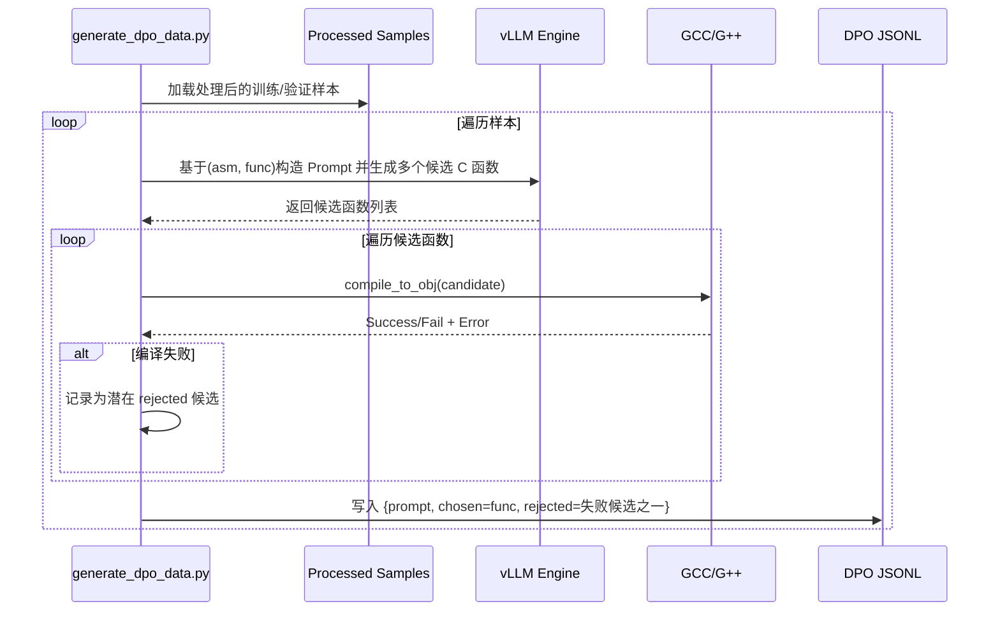
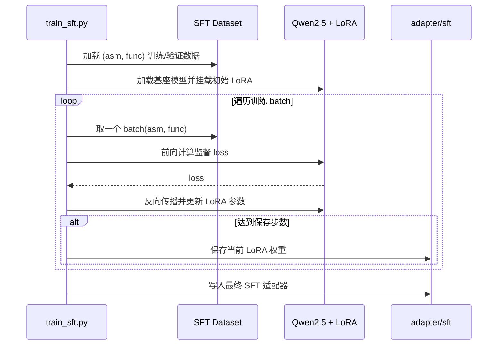
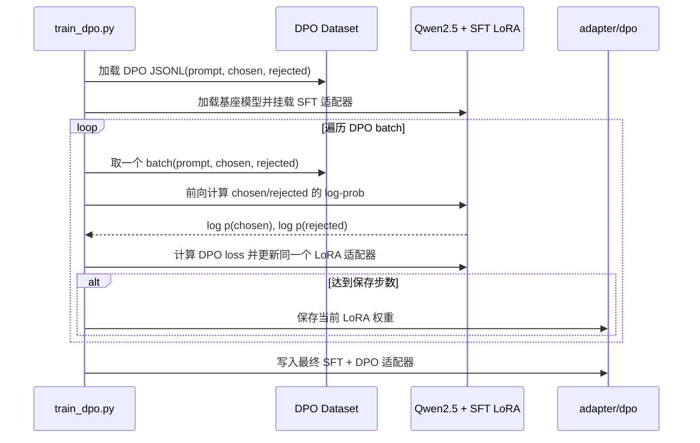
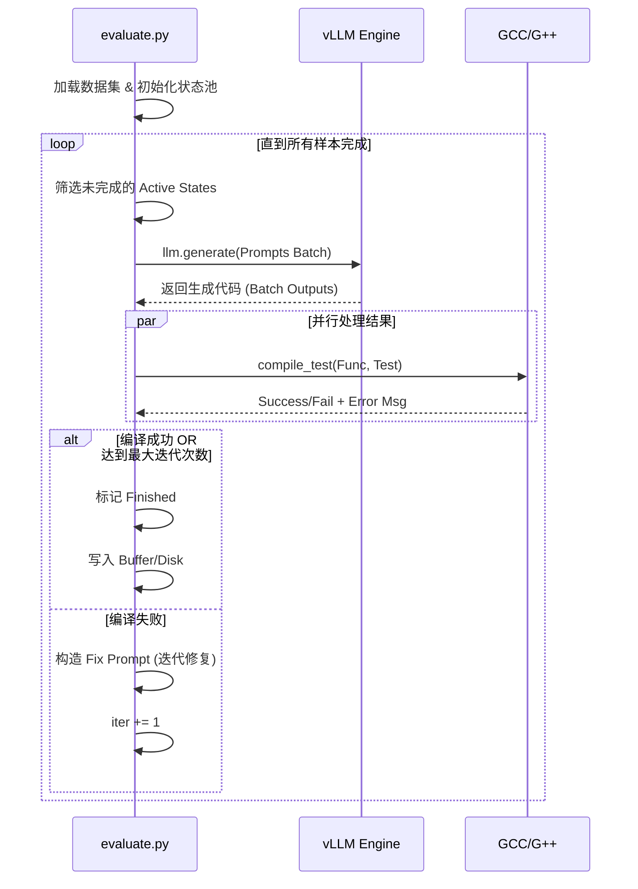
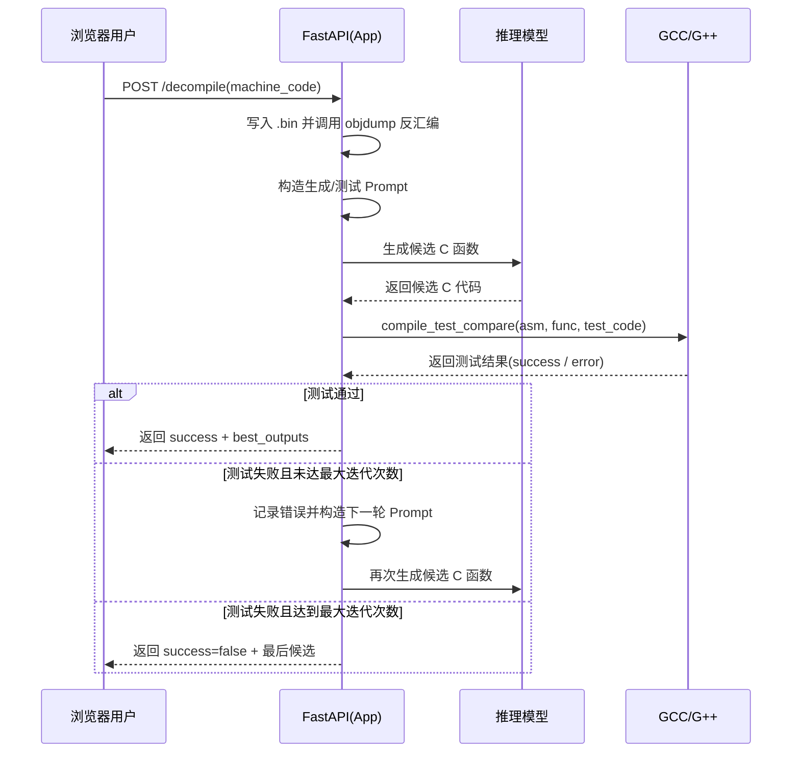

# LLM Feedback Decompiler 

**基于大语言模型 (LLM) 与编译器反馈机制的交互式反编译系统。**

本系统利用**编译器反馈循环 (Compiler Feedback Loop)** 机制，自动捕获模型生成的 C 函数代码中的编译错误，并将其反馈给模型进行自我修正，从而显著提高反编译代码的可编译性和准确性。

## 核心功能
- **交互式反编译**：支持 x86_64 架构的机器码反编译。
- **反馈循环机制**：系统自动验证生成的代码，如果编译测试失败，会将错误信息反馈给模型进行迭代修正。
- **Web 可视化界面**：提供直观的 Web UI，用户可直接输入 Hex 格式的机器码并查看反编译结果。


## 构建并启动环境

### 1. 使用本地环境

1. 安装 uv（全局一次即可）：
   ```bash
   pip install uv
   ```

2. 在项目根目录创建虚拟环境并按锁文件安装依赖：
   ```bash
   cd llm-feedback-decompile

   # 严格按 uv.lock 安装依赖
   uv sync --frozen
   ```

3. 激活本地虚拟环境：
    ```bash
    source .venv/bin/activate
    ```


### 2. 使用 Docker 构建环境

1. 构建镜像：
   ```bash
   docker build -t llm-feedback-decompile:latest .
   ```

2. 启动容器：
   ```bash
   docker run --gpus all -it \
     -p 8000:8000 \
     -v ${PWD}:/app \
     llm-feedback-decompile:latest \
     bash
   ```
- `-p 8000:8000` 暴露 Web 服务端口，将容器内 8000 端口映射到主机 8000 端口。
- `-v ${PWD}:/app` 挂载当前目录到容器 `/app` 目录，方便在容器内访问项目代码。

---

## 数据集

本项目模型训练和评估基于 **LLM4Decompile** 数据集。

### 1. 下载 LLM4Decompile 数据集
```bash
python download_data.py
```

- LLM4Decompile 数据格式说明
  - LLM4Decompile 数据集采用 JSONL 格式存储
  - decompile-bench
```json
{
  "name":"demangled name for the function",
  "code":"source code",
  "asm":"assembly",
  "file":"source code path"
}
```
  - decompile-eval
```json
{
  "index":"index of the function", 
  "func_name":"demangled name for he function", 
  "func_dep":"function dependecies (includes, help functions), or the path to the source code", 
  "func":"source code", 
  "test":"unit tests for the function, empty for github data", 
  "opt":"optimization, O0, O1, O2, O3", 
  "language":"language, c or cpp", 
  "asm":"assembly", 
  "ida_asm":"assembly from ida pro", 
  "ida_pseudo":"decompiled results (pseudo code) from ida pro", 
  "ghidra_asm":"assembly from ghidra", 
  "ghidra_pseudo":"decompiled results (pseudo code) from ghidra"
}
```
  - 原始数据保存到 `data/raw_data/` 。

### 2. 数据处理
```bash
python process_data.py
```

- decompile-bench 提取 func 和 asm，并按比例划分训练集和验证集；
- decompile-eval 提取 func_dep、func、test、asm，并自动加入 index；
- 通过计算代码的 MinHash 并利用局部敏感哈希（LSH）删除重复样本；
- 去重后的数据保存到 `data/processed_data/` 。
- 处理后的数据格式
  - decompile-bench
```json
{
  "func":"source code",
  "asm":"assembly",
}
```
  - decompile-eval
```json
{
  "index":"index of the function", 
  "func_dep":"function dependecies (includes, help functions), or the path to the source code", 
  "func":"source code", 
  "test":"unit tests for the function, empty for github data", 
  "asm":"assembly", 
}
```

### 3. 生成 DPO 数据
```bash
python generate_dpo_data.py
```

- DPO 数据构造方式
  - 使用训练集/验证集中的 `func`（正确 C 函数）和 `asm`（对应汇编）作为监督信号；
  - 通过 vLLM 加载基座模型（可选挂载 SFT LoRA），对每个样本生成多个候选 C 函数；
  - 使用编译器尝试编译每个候选函数，将**无法通过编译**的候选视为负样本；
  - 从编译失败的候选中随机选择一个作为 `rejected`，原始正确 `func` 作为 `chosen`。
- DPO 数据集格式示例
```json
{
  "prompt": "根据给定的汇编代码(<asm>)，输出一个在语义上完全等价的 C 函数实现",
  "chosen": "func",
  "rejected": "某个无法通过编译的候选 C 函数实现"
}
```
- 生成的 DPO 数据分别保存到 `data/dpo_data/train_data.jsonl` 和 `data/dpo_data/valid_data.jsonl`。



## 模型

本项目模型主要基于 **Qwen2.5-Coder-7B-Instruct** 模型。

### 1. 下载基座模型
```bash
python download_model.py
```

- 按配置的 `MODEL_NAME` 下载基座模型，支持断点续传、多次自动重试。
- 基座模型保存到 `model/Qwen/Qwen2.5-Coder-7B-Instruct/` 。

### 2. SFT 微调

**核心目标**：通过有监督微调 (Supervised Fine-Tuning)，让模型学会将汇编代码翻译为语义等价的 C 函数（Next Token Prediction）。

```bash
python train_sft.py
```

- 使用 Unsloth 加载 基座模型，并挂载 LoRA 适配器；
- 将 `asm` 和 `func` 格式化为对话式 Prompt；
- 进行 LoRA 微调，SFT 适配器权重保存到 `adapter/sft/`。



### 3. DPO 对齐

**核心目标**：通过直接偏好优化 (Direct Preference Optimization)，进一步抑制模型生成不可编译或低质量代码的倾向。

```bash
python train_dpo.py
```

- 加载基座模型，并在其上加载已经训练好的 SFT 适配器；
- 在 SFT 适配器的基础上继续进行 DPO 训练，直接优化同一个 LoRA 适配器；
- 训练完成后，将包含 SFT + DPO 效果的适配器保存到 `adapter/dpo/`。



### 4. 模型评估

```bash
python evaluate.py
```

- 在测试集上评估反编译测试成功率。
- 评估结果保存到 `eval/`。



## 启动 Web 服务
```bash
python src/app.py
```
浏览器访问 http://localhost:8000



## 配置说明
- 代码常量（路径、模型名、长度上限、镜像端点）
  - src/config.py
- 训练配置（可调超参）
  - configs/sft.yaml：包含 `training`、`lora`、`chat_template`
  - configs/dpo.yaml：与 SFT 对齐的三段结构
- 数据配置
  - configs/dataset.yaml：数据仓库、split、样本数与过滤规则


## 目录与结构约定
- src/：服务与核心模块（config、compiler、prompts、static）
- 顶层脚本：数据下载与处理、训练与评估
- configs/：所有 YAML 配置（sft.yaml、dpo.yaml、dataset.yaml）
- data/：原始与处理后数据、DPO 数据
- model/：下载的基座模型
- adapter/：SFT 与 DPO 适配器权重
